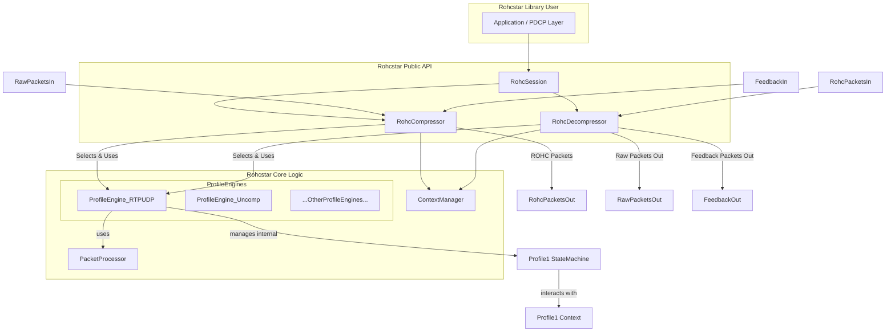

# Rohcstar Design Document

**Version:** 0.1.0
**Date:** May 15, 2025
**Author:** Carl Mitander

**Table of Contents:**

1.  **Introduction & Motivation**
    *   1.1. Project Vision: A Safe, Performant, and Robust ROHC Library
    *   1.2. Core Problems Addressed by ROHC (and Rohcstar)
    *   1.3. Rohcstar Project Goals
    *   1.4. Core Tenets (Safety, RFC Compliance, Testability, Performance, Extensibility)
2.  **Target Use Cases & Telecom Ecosystem**
    *   2.1. Primary Applications (5G/LTE PDCP, VoNR, IoT, Satellite)
    *   2.2. Wireless Link Challenges Addressed (BER, RTT, Loss, Reordering)
    *   2.3. Comparison with Existing Solutions (e.g., CRTP, IPHC - Why ROHC is Superior)
3.  **ROHC Standards and Profiles (Scope & Conformance)**
    *   3.1. Relevant RFCs (3095, 3843, 4815, 5225, 6846, etc.)
    *   3.2. Initial MVP Scope: Profile 0x0001 (RTP/UDP/IP) U-mode
        *   3.2.1. Specific Packet Types (IR, UO-0, basic UO-1)
        *   3.2.2. Encoding Mechanisms (LSB, W-LSB for SN)
    *   3.3. Phase 2 Scope: O-mode, R-mode, Feedback, Core Profiles (0, 2, 3)
    *   3.4. Long-Term Scope: ROHCv2, ROHC-TCP, ESP, Advanced Features
4.  **Rohcstar Library Architecture**
    *   4.1. Guiding Principles (Modularity, Layering, Minimal `unsafe`, Fuzzability)
    *   4.2. High-Level Component Diagram & Interactions
    *   4.3. Core Abstractions:
        *   4.3.1. `RohcContext` (State per CID)
        *   4.3.2. `RohcPacketRepresentation` (Internal structured packets)
        *   4.3.3. `ProfileController` (Manages specific profile logic)
        *   4.3.4. `CompressorLogic` / `DecompressorLogic` Traits
    *   4.4. Public API Design (`RohcSession`, `RohcCompressor`, `RohcDecompressor`)
        *   4.4.1. Configuration (Global, Per-Profile, Per-Context)
        *   4.4.2. Error Handling (`RohcError` enum)
5.  **Detailed Component Design**
    *   5.1. `ContextManager` / `ContextStore`
        *   5.1.1. Responsibilities: Storage, Retrieval, CID Lifecycle, `MAX_CID`.
        *   5.1.2. Data Structures for Context Memory (e.g., `HashMap<CID, SpecificRohcContext>`).
        *   5.1.3. Context Relocation (Signal `CONTEXT_REINITIALIZATION`).
    *   5.2. `PacketProcessor` (Parser/Builder Module)
        *   5.2.1. Uncompressed Header Parsing (IP, UDP, RTP, etc. - focus on necessary fields).
        *   5.2.2. ROHC Packet Parsing (IR, IR-DYN, UO-0, UO-1, UOR-2, Feedback formats, Add-CID, Padding, Extensions as per RFC 3095 5.2, 5.7).
        *   5.2.3. ROHC Packet Building (mirroring parsing).
        *   5.2.4. CRC Calculation and Verification (3-bit, 7-bit, 8-bit as per RFC 3095 5.9).
        *   5.2.5. Encoding/Decoding Mechanisms (LSB, W-LSB, Scaled Timestamps, Timer-Based Timestamps, Offset IP-ID, Self-Describing Variable Length - RFC 3095 4.5).
    *   5.3. `ProfileController` (e.g., `RtpUdpIpController`)
        *   5.3.1. Encapsulates profile-specific compressor and decompressor logic.
        *   5.3.2. Manages profile-specific context fields.
        *   5.3.3. Implements `CompressorLogic` and `DecompressorLogic` traits.
    *   5.4. `StateMachine` (Logic within each ProfileController)
        *   5.4.1. State Representation (Compressor: IR, FO, SO; Decompressor: NC, SC, FC - RFC 3095 4.3).
        *   5.4.2. Mode Representation (U, O, R - RFC 3095 4.4).
        *   5.4.3. Detailed Transition Logic (per RFC 3095 Ch. 5: optimistic approach, timeouts, feedback-driven).
        *   5.4.4. Feedback Processing & Generation (ACK, NACK, STATIC-NACK; FEEDBACK-1, FEEDBACK-2; Options - RFC 3095 5.2.1, 5.7.6).
    *   5.5. (Future) `ClassificationEngine`: For automatic profile detection.
6.  **Internal Data Structures & Context Fields**
    *   6.1. Per-Profile Compression Context (e.g., `RtpUdpIpCompressorContext`)
        *   Static Chain (IP addresses, ports, SSRC).
        *   Dynamic Chain (SN, TS, IP-ID reference values, LSB windows, offsets, change patterns like `TS_STRIDE`, `RND`/`NBO` flags).
        *   Mode and State variables.
        *   Feedback-related state (for O/R modes).
        *   List Compression state (e.g., CSRC translation tables - RFC 3095 5.8, 6.5.1).
    *   6.2. Per-Profile Decompression Context (e.g., `RtpUdpIpDecompressorContext`)
        *   Mirrors compressor context for reconstruction.
        *   Reassembly buffers (for ROHC segmentation).
        *   State for local repair mechanisms. (RFC 3095 5.3.2.2.4, 5.3.2.2.5).
    *   6.3. ROHC Packet Representations (Internal Enums/Structs for all defined types).
7.  **State Machine Modeling & Context Synchronization (Critical Section)**
    *   7.1. U-mode State Transitions (Compressor & Decompressor - RFC 3095 5.3).
    *   7.2. O-mode State Transitions (Compressor & Decompressor - RFC 3095 5.4).
    *   7.3. R-mode State Transitions (Compressor & Decompressor - RFC 3095 5.5).
    *   7.4. Mode Transitions (U<->O, U<->R, O<->R - RFC 3095 5.6).
    *   7.5. Context Establishment and Refresh (IR, IR-DYN packets).
    *   7.6. Context Damage: Detection (CRC failures), Impact (Loss/Damage Propagation), Repair (Local repair heuristics, feedback requests), Invalidation Scenarios (RFC 3095 4.7).
    *   7.7. Robustness Mechanisms: W-LSB interpretation windows, secure reference principle (R-mode), handling of residual errors.
8.  **Testing Strategy**
    *   8.1. Unit Tests: Packet field (en/de)coding, CRC, LSB logic, individual state transition functions.
    *   8.2. Integration Tests: Compressor <-> Decompressor loop for each profile/mode, feedback cycles.
    *   8.3. Regression Tests: Using known ROHC traces (e.g., from RFC examples, other implementations, Effnet's HC-Sim outputs if available, or captured traffic). `insta` for snapshots.
    *   8.4. Deterministic Simulation Testing (DST):
        *   Focus on state synchronization across a simulated lossy/reordering link.
        *   Test robustness of U/O/R modes against various impairment patterns (burst loss, random loss, high jitter affecting timer-based TS).
    *   8.5. **Fuzzing with Drifter** (Continuous Validation).
9.  **Integration with Drifter Fuzzer**
    *   9.1. Rohcstar as a Library Target: `InProcessExecutor` for direct API calls.
    *   9.2. Key Fuzzing Harnesses:
        *   `fuzz_decompressor(rohc_packet_stream: &[u8], initial_context_state)`
        *   `fuzz_compressor(uncompressed_packet_stream: &[Vec<u8>], initial_config)`
        *   `fuzz_feedback_handler(compressor_state, feedback_packet: &[u8])`
        *   `fuzz_packet_parser(specific_rohc_packet_type_bytes: &[u8])`
        *   `fuzz_api_sequences(calls_to_public_api)`
    *   9.3. Drifter Capabilities & Enhancements Driven by Rohcstar:
        *   **Structure-Aware Mutator:** Essential for ROHC packet fields.
        *   **Stateful Sequence Generation:** Drifter's `StateManager` will use Rohcstar's state model.
        *   **Custom ROHC Oracles:** For protocol conformance and context validation.
        *   **Coverage-Guided Fuzzing:** For code and state-machine transition coverage.
10. **Future Extensions for Rohcstar**
    *   10.1. Full Profile Suite: ROHCv2 (RFC 5225), ROHC-TCP (RFC 6846), ROHC-ESP, etc.
    *   10.2. Advanced ROHC Features: List Compression, Segmentation/Reassembly, Reverse Decompression.
    *   10.3. Performance Optimizations: Memory pooling, SIMD.
    *   10.4. Dynamic Configuration & Control: Callbacks, richer statistics.
    *   10.5. (Far Future) Kernel-space integration, API hooks for hardware offload.
11. **Rust Style Guide & Commit Conventions**
    *   Strict adherence to `rustfmt` (project `rustfmt.toml`).
    *   Conventional Commits (`type(scope): lowercase description`) enforced by Git hooks.

---

### 1. Introduction & Motivation

**1.1. Project Vision: A Safe, Performant, and Robust ROHC Library**

Rohcstar is a new, open-source Robust Header Compression (ROHC) library meticulously engineered in Rust. It aims to deliver a memory-safe, highly performant, and rigorously verified implementation of ROHC standards (IETF RFC 3095 and its profile-specific extensions like RFC 3843, RFC 4815, RFC 5225). The project is born from the understanding that efficient header compression is critical in modern IP networks, especially over constrained wireless links prevalent in LTE, 5G (VoNR, eMBB, IoT), and satellite communications.

The core motivation is to provide a reliable and extensible alternative to existing C-based implementations, leveraging Rust's safety guarantees while meeting the stringent performance demands of telecom infrastructure (e.g., PDCP layer in gNodeBs). Rohcstar will be co-developed with **Drifter**, a custom, state-of-the-art fuzzer, ensuring that security, correctness, and robustness against malformed or unexpected inputs are integral to the design from day one.

**1.2. Core Problems Addressed by ROHC (and Rohcstar)**

Packet headers (IPv4/IPv6, UDP, RTP, TCP, ESP) constitute significant overhead, especially for applications with small payloads like VoIP or IoT data. Over wireless links (cellular, satellite), this overhead consumes scarce bandwidth and can degrade Quality of Service (QoS) due to increased transmission time and susceptibility to errors. ROHC addresses this by:

*   Compressing redundant header information across packets in a stream.
*   Maintaining context at both compressor and decompressor to allow sending only changes or minimal identifiers.
*   Providing mechanisms for robustness against packet loss and bit errors inherent in wireless channels.

Rohcstar aims to be an exemplary implementation of these solutions.

**1.3. Rohcstar Project Goals**

*   **Correctness & Conformance:** Implement ROHC profiles (initially Profile 1, then 0, 2, 3) and modes (U, O, R) in strict accordance with relevant IETF RFCs, particularly RFC 3095, RFC 3843, RFC 4815, and RFC 5225.
*   **Memory Safety & Security:** Leverage Rust's memory safety features to prevent vulnerabilities like buffer overflows, use-after-frees, etc., which are critical concerns in network protocol implementations. `unsafe` code will be minimized and heavily scrutinized.
*   **High Performance:** Achieve compression and decompression throughput suitable for real-time telecom applications (e.g., 5G gNB PDCP layer), with a focus on low latency and efficient CPU utilization.
*   **Robustness:** Design and implement ROHC mechanisms that are highly resilient to packet loss, reordering, and bit errors, ensuring rapid context synchronization and repair as outlined in the RFCs.
*   **Modularity & Extensibility:** Create a clean, well-defined architecture that allows for the straightforward addition of new ROHC profiles, modes, or specific encoding/decoding schemes in the future.
*   **Comprehensive Testability:** Ensure every component, particularly packet parsers/builders and state machines, is easily unit-testable. The entire library will be subject to continuous, deep fuzzing with Drifter.
*   **Portability:** While primarily a Rust library, the core logic should be platform-agnostic. OS-specific dependencies will be avoided in the core library.

**1.4. Core Tenets**

*   **RFCs as the Bible:** The relevant IETF RFCs are the definitive source of truth for protocol behavior and implementation details.
*   **Security by Design:** Rust's safety features are a cornerstone. Prioritize safe patterns and APIs.
*   **Fuzz Early, Fuzz Often:** Integrate Drifter fuzzing from the earliest stages of component development to uncover bugs in parsing, state logic, and context handling.
*   **State is Sacred:** ROHC is intensely stateful. Context management, precise state transitions, and robust synchronization mechanisms are critical design pillars.
*   **Robust Context Synchronization:** Mechanisms for maintaining or quickly repairing context in the face of packet loss and reordering are paramount.
*   **Clarity and Maintainability:** Write clear, idiomatic Rust code. The complexity of ROHC demands a codebase that is easy to understand, debug, and extend.
*   **Performance Awareness:** While safety and correctness come first, design choices will consider performance implications for target use cases.

---

### 2. Target Use Cases & Telecom Ecosystem

**2.1. Primary Applications**

*   **5G NR User Plane (PDCP Layer):** Compressing IP/UDP/RTP headers for Voice over New Radio (VoNR), enhanced Mobile Broadband (eMBB) data flows, IoT over 5G, and other user plane traffic. Rohcstar aims to be suitable for integration into gNodeB and UE PDCP entities.
*   **LTE User Plane (PDCP Layer):** Similar applications as 5G, including VoLTE.
*   **Satellite Communication Links:** Reducing header overhead for expensive and often high-latency, lossy satellite bandwidth.
*   **Wireless Backhaul/Fronthaul:** Optimizing bandwidth on microwave or other constrained links within the Radio Access Network (RAN).
*   **Constrained IoT Networks:** Minimizing data transmission for battery-powered and low-bandwidth IoT devices using IP protocols.

**2.2. Wireless Link Challenges Addressed**

Rohcstar's ROHC implementation directly targets the challenges common in wireless and other non-ideal links:

*   **Packet Loss:** ROHC's state machines and feedback mechanisms (especially in O/R modes) are designed to handle packet loss and trigger context repair or resynchronization.
*   **Packet Reordering:** W-LSB encoding and sequence number interpretation rules in ROHC provide resilience to a certain degree of packet reordering.
*   **High Protocol Overhead:** ROHC significantly reduces the 40-60+ bytes of typical IP/UDP/RTP headers down to a few bytes (1-4 bytes in optimal cases), drastically improving spectral efficiency.
*   **Variable Link Quality & Bit Errors (BER):** ROHC uses CRCs on compressed headers to detect corruption. While ROHC itself doesn't correct bit errors, its robustness helps maintain context or re-establish it quickly when errors occur. RFC 3095 notes ROHC is designed to cope with residual errors up to 1E-5 BER without increasing damaged headers.
*   **Long Round-Trip Times (RTT):** ROHC modes (especially U-mode and O-mode) are designed to be efficient even with long RTTs, minimizing reliance on immediate feedback compared to older schemes like CRTP.

**2.3. Comparison with Existing Solutions**

*   **CRTP (RFC 2508):** Compresses IP/UDP/RTP. Performs poorly on lossy links with long RTTs due to its context repair mechanism relying on explicit signaling, leading to significant loss propagation. Lacks robustness for modern wireless.
*   **IPHC (RFC 2507):** Compresses general IP/TCP/UDP. More robust than CTCP (VJHC) but still less so than ROHC for IP/UDP/RTP over cellular links. Does not compress RTP as effectively as ROHC.
*   **ROHC (RFC 3095 onwards):** Designed specifically for robustness and efficiency over links with high loss and long RTTs. Employs more sophisticated context management, state machines, encoding schemes (W-LSB), and feedback options, leading to better compression ratios and significantly lower packet loss propagation compared to CRTP/IPHC in target environments.

Rohcstar aims to provide the benefits of ROHC with the added advantages of Rust's memory safety and modern software engineering practices.

---

### 3. ROHC Standards and Profiles (Scope & Conformance)

**3.1. Relevant RFCs**

Rohcstar will primarily target conformance with:

*   **RFC 3095:** "RObust Header Compression (ROHC): Framework and four profiles: RTP, UDP, ESP, and uncompressed." This is the foundational document.
*   **RFC 3843:** "RObust Header Compression (ROHC): A Compression Profile for IP." (Defines Profile 0x0003 and updates general IP aspects).
*   **RFC 4815:** "RObust Header Compression (ROHC): Corrections and Clarifications to RFC 3095." (Essential errata and clarifications).
*   **RFC 5225:** "RObust Header Compression Version 2 (ROHCv2): Profiles for RTP, UDP, IP, ESP and UDP-Lite." (Future scope).
*   **RFC 6846:** "RObust Header Compression (ROHC): A Profile for TCP/IP (ROHC-TCP)." (Future scope).
*   Supporting RFCs for L3/L4 protocols being compressed (e.g., RFC 791 for IPv4, RFC 768 for UDP, RFC 3550 for RTP).

**3.2. Initial MVP Scope: Profile 0x0001 (RTP/UDP/IP) U-mode**

*   **Profile:** ROHC RTP (Profile ID 0x0001), compressing IPv4/UDP/RTP headers.
*   **Mode:** Unidirectional (U-mode) only.
*   **3.2.1. Specific Packet Types (RFC 3095, Section 5.7):**
    *   Compressor generates: IR, UO-0, UO-1 (SN LSB only variant, no TS or IP-ID LSB for MVP).
    *   Decompressor parses: IR, UO-0, UO-1 (SN LSB only variant).
    *   No Extension Headers for MVP.
    *   No Segmentation for MVP.
    *   Feedback packets are not processed by the compressor in U-mode.
*   **3.2.2. Encoding Mechanisms (RFC 3095, Section 4.5):**
    *   Least Significant Bits (LSB) and Window-based LSB (W-LSB) for RTP Sequence Number (SN).
    *   Static field transmission in IR packets.
    *   Basic CRC: 8-bit for IR, 3-bit for UO-0.
*   **Functionality:** Context establishment via IR, compression/decompression of subsequent packets in FO state using UO-0/UO-1 for SN changes. Basic state transitions (IR<->FO for compressor; NC->SC->FC and basic error-driven downward transitions for decompressor).

**3.3. Phase 2 Scope: O-mode, R-mode, Feedback, Core Profiles (0, 2, 3)**

*   **Enhance Profile 0x0001:** Implement O-mode and R-mode, including full feedback processing (FEEDBACK-1, FEEDBACK-2, ACK, NACK, STATIC-NACK, CRC option) and state transitions. Implement SO state. Add W-LSB for RTP Timestamp (TS) and IP-ID.
*   **Add Profile 0x0000 (Uncompressed):** Passthrough of packets with ROHC framing.
*   **Add Profile 0x0002 (UDP/IP):** Non-RTP UDP/IP compression (U/O/R modes).
*   **Add Profile 0x0003 (IP-only):** IP header compression (U/O/R modes).

**3.4. Long-Term Scope: ROHCv2, ROHC-TCP, ESP, Advanced Features**

*   Implementation of ROHCv2 profiles (RFC 5225).
*   Implementation of ROHC-TCP (RFC 6846).
*   Implementation of ROHC ESP (Profile 0x0003 from RFC 3095 for ESP with NULL encryption, or newer ESP profiles).
*   List compression, segmentation, and other advanced ROHC features.

---

*(Sections 4-11 of the Design Document will follow the same structure as generated in the previous detailed response, but specifically tailored to Rohcstar, referencing ROHC RFCs for packet formats, state transitions, context fields, etc. I will provide these sections now.)*

---

### 4. Rohcstar Library Architecture

**4.1. Guiding Principles**
*   **Modularity:** Separate concerns for context management, packet parsing/building, and profile-specific state machine logic.
*   **Layering:** A clear distinction between the public API, the core ROHC engine orchestrating profiles, and the individual profile implementations.
*   **Minimal `unsafe` Code:** Adherence to safe Rust. Any `unsafe` block must be minimal, justified, and heavily reviewed.
*   **Fuzzability:** Design internal components and the public API with clear entry points for Drifter fuzzing harnesses. Expose enough internal state (through debug or specific APIs) to allow oracles to validate behavior.

**4.2. High-Level Component Diagram & Interactions**

*   **RohcSession:** A higher-level construct that might manage multiple CIDs and associated compressors/decompressors for a user.
*   **RohcCompressor/Decompressor:** Public API entry points, likely holding a `ContextManager` and dispatching to `ProfileEngine`s.
*   **ContextManager:** Stores `SpecificRohcContext` instances per CID.
*   **PacketProcessor:** Handles bit-level parsing and building of all ROHC and relevant L3/L4 headers.
*   **ProfileEngine:** Contains the state machine and compression/decompression logic specific to one ROHC profile (e.g., RTP/UDP/IP).

**4.3. Core Abstractions**

*   **`SpecificRohcContext` (Concrete Structs per Profile Family):**
    *   E.g., `RtpUdpIpContext`, `UdpIpContext`. These hold all static and dynamic fields necessary for a given profile group.
    *   Will contain current state (IR/FO/SO or NC/SC/FC), mode (U/O/R), W-LSB windows, reference values, etc.
*   **`RohcPacket` (Internal Enum):**
    *   `enum RohcPacket { IR { ...fields... }, UO0 { ...fields... }, Feedback1 { ... }, ... }`
    *   Represents parsed ROHC packets in a structured way before processing or after building.
*   **`ProfileController` Trait (or similar for Profile Engines):**
    ```rust
    pub trait ProfileController {
        type Context: Default + Debug + Clone; // The specific context struct for this profile

        fn compress_packet(&self, context: &mut Self::Context, uncompressed_header: &[u8], payload: &[u8]) -> Result<Vec<Vec<u8>>, RohcError>;
        fn decompress_packet(&self, context: &mut Self::Context, rohc_packet: &[u8]) -> Result<(Vec<(Vec<u8>,Vec<u8>)>, Option<Vec<u8>>), RohcError>; // (hdrs+payloads, opt_feedback)
        fn process_feedback(&self, context: &mut Self.Context, feedback_packet: &[u8]) -> Result<(), RohcError>;
        fn get_profile_id(&self) -> u8;
    }
    ```
    The main `RohcCompressor` / `RohcDecompressor` would hold a collection of `Box<dyn ProfileController>` or dispatch based on profile ID to concrete implementations.

**4.4. Public API Design (`rohcstar/src/lib.rs`)**

*   **`RohcCompressor::new(config: GlobalConfig) -> Self`**
*   **`RohcCompressor::compress(&mut self, flow_id: FlowIdentifier, uncompressed_ip_packet: &[u8]) -> Result<Vec<Vec<u8>>, RohcError>`**
    *   `flow_id` could be a tuple `(src_ip, dst_ip, src_port, dst_port, protocol)` used by an internal classifier to find/create a CID and context. Or API could take `cid: u16` directly if user manages CIDs.
*   **`RohcCompressor::process_feedback(&mut self, cid: u16, feedback_packet: &[u8]) -> Result<(), RohcError>`**
*   **`RohcDecompressor::new(config: GlobalConfig) -> Self`**
*   **`RohcDecompressor::decompress(&mut self, rohc_packet_in: &[u8]) -> Result<DecompressorOutput, RohcError>`**
    *   `struct DecompressorOutput { pub cid: u16, pub decompressed_packets: Vec<Vec<u8>>, pub feedback_to_send: Option<Vec<u8>> }`
*   **Configuration Structs:**
    *   `GlobalConfig`: Max CIDs, default profiles enabled.
    *   `ProfileConfig`: Specific parameters for each profile (e.g., `W_LSB_FO_SN_WINDOW_SIZE` for RTP profile).
*   **`RohcError` Enum:** Detailed error variants for different failure conditions (parsing, invalid state, CRC error, context not found, resource limits, etc.).

---

### 5. Detailed Component Design

**5.1. `ContextManager` / `ContextStore`**
*   **Responsibilities:** CRUD for ROHC contexts associated with CIDs. Enforces `MAX_CID` (RFC 3095, 5.1.1). Potentially handles context relocation signals (`CONTEXT_REINITIALIZATION`).
*   **Data Structure:** `HashMap<u16, ProfileContextVariant>`, where `ProfileContextVariant` is an enum wrapper for specific profile contexts (e.g., `RtpUdpIpContext`).
*   **CID Management:** For small CID space (0-15) vs. large CID space (up to 16383) as per `LARGE_CIDS` parameter.

**5.2. `PacketProcessor` (Parser/Builder Module)**
*   **Uncompressed Header Parsing:** Functions for IPv4, IPv6 (later), UDP, RTP. Extract fields required for ROHC context initialization (static fields) and delta calculation (dynamic fields like SN, TS, IP-ID).
*   **ROHC Packet Parsing:** One function per ROHC packet type (IR, IR-DYN, UO-0, UO-1 various forms, UOR-2 various forms, Feedback-1, Feedback-2, Add-CID, Padding, Extensions 0, 1, 2, 3). These will be complex due to variable length fields, context-dependent interpretation, and packed bits. All parsing will strictly follow RFC 3095, Section 5.7.
*   **ROHC Packet Building:** Counterpart functions for constructing each ROHC packet type from internal structured representations and context data.
*   **CRC Calculation/Verification:** Implement 3-bit, 7-bit (for feedback options), and 8-bit CRC logic with polynomials from RFC 3095, Section 5.9.
*   **Encoding/Decoding Mechanisms:** Implement generic LSB and W-LSB encoding/decoding (RFC 3095, 4.5.1, 4.5.2). Implement Scaled RTP Timestamp and Timer-based RTP Timestamp logic (RFC 3095, 4.5.3, 4.5.4). Implement Offset IP-ID encoding (RFC 3095, 4.5.5). Implement Self-describing variable-length value encoding (RFC 3095, 4.5.6) for parameters like TS_STRIDE.

**5.3. `ProfileController` (e.g., `RtpUdpIpController`)**
*   This module will house the core logic for a given ROHC profile.
*   **Compressor Logic:**
    *   Receives uncompressed packets.
    *   Interacts with `ContextManager` to get/update the `RtpUdpIpContext`.
    *   Applies the Profile 1 U-mode (then O/R-mode) compressor state machine.
    *   Decides which ROHC packet type to build based on current context, state, and changes in uncompressed headers.
    *   Uses `PacketProcessor` to build the ROHC packet.
    *   Handles feedback packets by updating context and potentially compressor state.
*   **Decompressor Logic:**
    *   Receives ROHC packets.
    *   Uses `PacketProcessor` to parse the packet type and fields.
    *   Interacts with `ContextManager` to get/update the `RtpUdpIpContext`.
    *   Applies the Profile 1 U-mode (then O/R-mode) decompressor state machine.
    *   Uses `PacketProcessor` and context to reconstruct original headers.
    *   Determines if feedback needs to be generated and uses `PacketProcessor` to build it.

**5.4. `StateMachine` (Logic within each ProfileController)**
*   **State Representation:** `enum CompressorState { IR, FO, SO }`, `enum DecompressorState { NoContext, StaticContext, FullContext }`. Each state might carry associated data (e.g., FO state timers, SO state confidence counters).
*   **Mode Representation:** `enum OperatingMode { U, O, R }` stored within the context.
*   **Transition Logic:** Implement functions for each (state, event) -> next_state transition based on RFC 3095 Chapter 5. Events include:
    *   Compressor: uncompressed packet characteristics, received feedback (ACK, NACK, STATIC-NACK), timeouts, need for update.
    *   Decompressor: received ROHC packet type, CRC result, sequence number validation.
*   **Feedback Processing:** Parse FEEDBACK-1, FEEDBACK-2. Handle options (CRC, SN, etc.). Update compressor context and state based on ACK/NACK.
*   **Feedback Generation:** Logic for decompressor to decide when and what type of feedback to send based on its state and received packets.

---

### 6. Internal Data Structures & Context Fields

**6.1. Per-Profile Compression Context (e.g., `RtpUdpIpCompressorContext` for Profile 0x0001)**
*   **Static Chain (established by IR):** Source/Destination IP, Source/Destination UDP Port, RTP SSRC. Other static IP/UDP/RTP fields.
*   **Dynamic Chain (updated by IR, FO, SO packets):**
    *   RTP SN: Reference value (`v_ref_sn`), W-LSB window parameters (if applicable for chosen W-LSB variant).
    *   RTP TS: Reference value (`v_ref_ts`), scaling factor (`TS_STRIDE`), offset (`TS_OFFSET`), W-LSB window.
    *   IPv4 ID: Reference value (`v_ref_ipid`), offset from SN (`IPID_OFFSET`), RND/NBO flags.
*   **Compressor State:** `current_state: CompressorState` (IR, FO, SO).
*   **Operating Mode:** `current_mode: OperatingMode` (U, O, R).
*   **Parameters:** `MAX_CID`, `LARGE_CIDS`, list of `PROFILES` acceptable to decompressor.
*   **Feedback State (O/R modes):** Sliding window of sent update packets awaiting ACKs, RTT estimates.
*   **List Compression State:** Translation tables for CSRC list, IP extension headers.
*   Timers for periodic refreshes (U-mode) or ACK timeouts (R-mode).

**6.2. Per-Profile Decompression Context (e.g., `RtpUdpIpDecompressorContext`)**
*   Mirrors most of the compressor context for reconstruction.
*   **Decompressor State:** `current_state: DecompressorState` (NoContext, StaticContext, FullContext).
*   **Operating Mode:** `current_mode: OperatingMode`.
*   Last correctly reconstructed SN, TS, IP-ID to serve as `v_ref_d`.
*   W-LSB decompression window.
*   Parameters needed for feedback generation (e.g., last ACKed SN).
*   Reassembly buffer state if ROHC segmentation is supported.

**6.3. ROHC Packet Representations**
*   Internal, rich enums/structs for each ROHC packet type defined in RFC 3095 (IR, IR-DYN, UO-0, UO-1-ID, UO-1-TS, UOR-2-ID, UOR-2-TS, FEEDBACK-1, FEEDBACK-2, etc.) and their extension headers. These structs will make it easier to manipulate packet fields logically before serializing to bits or after parsing from bits. Example:
    ```rust
    struct RohcIrPacket {
        cid_info: Option<CidInfo>, // Add-CID or embedded CID
        profile: u8,
        crc8: u8,
        static_chain_data: Vec<u8>, // Or structured fields
        dynamic_chain_data: Option<Vec<u8>>, // Or structured fields
    }
    enum CidInfo { AddCid(u8), EmbeddedCidSmall(u8), EmbeddedCidLarge(u16), NoCid }
    ```

---

### 7. State Machine Modeling & Context Synchronization (Critical Section)

The correct and robust implementation of ROHC state machines and context synchronization is paramount. This section will adhere strictly to RFC 3095, primarily Chapter 4 (Framework) and Chapter 5 (Operation in Modes).

**7.1. U-mode State Transitions (Compressor & Decompressor - RFC 3095, Section 5.3)**
*   **Compressor (Profile 1 U-mode MVP):**
    *   Starts in IR state.
    *   Sends IR packets to establish/refresh static context.
    *   Transitions IR -> FO ("Optimistic approach"): After sending enough IR packets with the same static information such that it's reasonably confident the decompressor has received it (the RFC doesn't define "enough"; this is an implementation parameter, often 1-3 packets depending on expected RTT and loss).
    *   Stays in FO: Sends UO-0, UO-1, UOR-2 (as applicable by profile) to communicate changes in dynamic fields (like SN, TS, IP-ID using LSB/W-LSB).
    *   Transition FO -> IR ("Timeout" or "Need for update"):
        *   Periodically due to a timeout (implementation-defined, e.g., every N packets or M seconds) to ensure context validity at the decompressor (RFC 3095, Section 5.3.1.1.2).
        *   Immediately if the header to be compressed no longer conforms to the established pattern (e.g., a static field changes, or a dynamic field changes too much for current LSB encoding) (RFC 3095, Section 5.3.1.1.3).
*   **Decompressor (Profile 1 U-mode MVP):**
    *   Starts in No Context (NC) state. Discards all packets except IR.
    *   Transition NC -> Full Context (FC): Upon successful decompression (CRC valid) of an IR packet. Stores static and dynamic context.
    *   Stays in FC: Decompresses UO-0, UO-1, UOR-2 based on its context. Updates dynamic context (e.g., reference SN for W-LSB).
    *   Transition FC -> Static Context (SC): If CRC fails for k1 out of n1 packets (RFC 3095, Section 5.3.2.2.3 rule b). Context damage assumed.
    *   Transition SC -> No Context (NC): If CRC fails for k2 out of n2 *updating* packets (IR, IR-DYN, UOR-2) received while in SC state (RFC 3095, Section 5.3.2.2.3 rule c). Static context damage assumed.
    *   Transition SC -> FC: Upon successful decompression of an IR, IR-DYN, or UOR-2 packet.

**7.2. O-mode State Transitions (Compressor & Decompressor - RFC 3095, Section 5.4) (Phase 2)**
*   Builds upon U-mode logic.
*   No periodic timeouts for compressor downward transitions.
*   Downward transitions (FO->IR, SO->FO) are triggered by NACKs or STATIC-NACKs from the decompressor.
*   Upward transitions (IR->FO, FO->SO) can be accelerated by ACKs.
*   Decompressor sends ACK(O) for valid IRs/updates, NACK(O) for CRC failures in FC, STATIC-NACK(O) for issues in NC/SC or IR failures.

**7.3. R-mode State Transitions (Compressor & Decompressor - RFC 3095, Section 5.5) (Phase 2)**
*   Compressor confidence for upward transitions based *only* on ACKs (secure reference principle).
*   Stricter logic to prevent context desynchronization.
*   More intensive use of feedback; ACKs for all context-updating packets.
*   Specific rules for using R-0, R-1, UOR-2 packets.

**7.4. Mode Transitions (U<->O, U<->R, O<->R - RFC 3095, Section 5.6) (Phase 2)**
*   Logic for initiating and completing transitions between U, O, and R modes, typically triggered by the decompressor via feedback packets carrying the desired mode.
*   Involves handshakes and specific packet usage during the transition phase (C_TRANS, D_TRANS parameters).

**7.5. Context Establishment and Refresh**
*   Primarily through IR and IR-DYN packets. IR initializes/re-initializes both static and dynamic parts. IR-DYN refreshes/initializes dynamic parts, assuming static context exists.
*   CRC-STATIC vs CRC-DYNAMIC (RFC 3095, Section 5.9.2) to optimize CRC calculation. Context stores the saved CRC-STATIC part.

**7.6. Context Damage: Detection, Impact, Repair, Invalidation Scenarios**
*   **Detection:** Primarily via CRCs in compressed headers (3-bit, 7-bit, 8-bit).
*   **Impact:** Loss propagation (subsequent packets cannot be decompressed) or damage propagation (incorrectly decompressed headers delivered).
*   **Repair (Decompressor in U/O-mode):**
    *   SN LSB wraparound correction (RFC 3095, Section 5.3.2.2.4): Using local clock or inter-arrival times to guess if SN wrapped.
    *   Repair of incorrect SN updates (RFC 3095, Section 5.3.2.2.5): Using last two known good SNs as references if current decompression fails.
*   **Invalidation Scenarios (RFC 3095, Section 4.7):** Design to mitigate or correctly handle scenarios like undetected errors updating context, loss of pattern updates, SN desynchronization, or fake ACKs.

**7.7. Robustness Mechanisms**
*   W-LSB interpretation windows: Key to handling loss for sequence numbers, timestamps, IP-IDs.
*   Secure reference principle (R-mode): Only CRC-protected packets update context and can be references.
*   CRC coverage in IR/IR-DYN packets MUST cover context-initializing information (RFC 3095, Section 5.2.3, 5.2.4).
*   Handling of residual errors (packets delivered with undetected errors).

---

### 8. Testing Strategy

A multi-faceted testing strategy is essential for Rohcstar's reliability.

**8.1. Unit Tests**
*   **PacketProcessor:** For every ROHC packet type and relevant L3/L4 header:
    *   Test parsing valid byte streams into internal struct representations.
    *   Test building internal structs into correct byte streams.
    *   Test with edge cases, malformed inputs, and boundary values for fields.
*   **Encoding/Decoding Logic:** Specific tests for LSB, W-LSB (various k values, window sizes, wraparound), Scaled TS, Timer-based TS, Offset IP-ID.
*   **CRC Calculations:** Test CRC-3, CRC-7, CRC-8 algorithms with known inputs/outputs.
*   **StateMachine Logic:** Test individual state transition functions: given a current state, context, and event (e.g., packet type, feedback, timeout), verify the next state and context modifications are correct.
*   **Context Updates:** Test functions that modify context fields based on compressed or uncompressed header information.

**8.2. Integration Tests**
*   **Compressor <-> Decompressor Loop:**
    *   For each implemented profile and mode (starting with Profile 1 U-mode).
    *   Send a stream of related uncompressed packets to `RohcCompressor`.
    *   Pipe the ROHC output to `RohcDecompressor`.
    *   Pipe any feedback from decompressor back to compressor (for O/R modes).
    *   Verify that all original packets are perfectly reconstructed by the decompressor.
    *   Verify context synchronization between compressor and decompressor.
*   **Specific Scenarios:** Test sequences involving all state transitions (IR->FO, FO->SO, SO->FO, FO->IR, etc.), mode transitions, context refreshes, handling of various ROHC packet types and extensions.

**8.3. Regression Tests**
*   Maintain a corpus of:
    *   Known-good ROHC packet capture files (pcaps) from other implementations or test tools (if available).
    *   Problematic streams that previously caused bugs in Rohcstar (once found).
    *   Streams that test specific RFC edge cases or examples.
*   Run these through Rohcstar's decompressor (and compressor if applicable) on every commit to catch regressions.
*   Use `insta` for snapshotting decompressed output or relevant internal states for complex test cases.

**8.4. Deterministic Simulation Testing (DST)**
*   **Focus:** Robustness of state synchronization and feedback mechanisms under adverse link conditions, especially for O-mode and R-mode.
*   **Setup:**
    1.  Instantiate a Rohcstar `Compressor` and `Decompressor` within a test harness.
    2.  Create a simulated "NetworkChannel" object that sits between them.
    3.  This channel can be programmed (deterministically based on a seed) to:
        *   Drop ROHC packets (from C to D).
        *   Drop Feedback packets (from D to C).
        *   Reorder packets.
        *   Introduce bit errors into packets (requiring CRC checks to fail).
        *   Introduce variable delays.
    4.  Feed a stream of uncompressed packets to the compressor.
    5.  Pass traffic through the simulated faulty channel.
    6.  Verify:
        *   End-to-end correctness (decompressed matches original, accounting for acknowledged losses).
        *   Contexts remain synchronized or recover correctly and efficiently.
        *   No excessive error propagation.
        *   Correct transitions to lower/higher compression states based on simulated conditions.
*   **Tools:** Can be a custom simulation framework or inspired by libraries like `turmoil` if the paradigm fits library testing.

**8.5. Fuzzing with Drifter (Continuous Validation)**
*   Integrate Drifter harnesses into the CI pipeline.
*   Fuzz nightly or on every significant change.
*   Maintain a corpus of interesting inputs found by Drifter.

---

### 9. Integration with Drifter Fuzzer

Drifter is a strategic tool for Rohcstar, not an afterthought.

**9.1. Rohcstar as a Library Target**
*   Rohcstar's public API (`RohcCompressor::compress`, `RohcCompressor::process_feedback`, `RohcDecompressor::decompress`) will be the direct entry points for fuzz harnesses.
*   Drifter's `InProcessExecutor` is ideal for calling these Rust API functions.

**9.2. Key Fuzzing Harnesses**
1.  **Decompressor Input Fuzzing (Primary Initial Target):**
    *   **Input:** `rohc_packet_stream: &[u8]` (can be single or multiple concatenated ROHC packets).
    *   **Harness Logic:**
        ```rust
        // fn harness_decompressor(data: &[u8]) {
        //     let mut decompressor = RohcDecompressor::new(DecompressorGlobalConfig::default_for_profile1_umode());
        //     // Optional: Initialize decompressor context to a specific state based on fuzzed prefix
        //     let _ = decompressor.decompress(data); // Interested in panics or RohcError
        // }
        ```
2.  **Compressor Input Fuzzing:**
    *   **Input:** `uncompressed_packet_stream: &[Vec<u8>]` (sequence of uncompressed packets).
    *   **Harness Logic:** Similar, calling `compressor.compress()` repeatedly.
3.  **Feedback Packet Fuzzing (Post-MVP for O/R modes):**
    *   **Input:** `feedback_packet: &[u8]`.
    *   **Harness Logic:** Initialize compressor, potentially send some packets to establish context, then call `compressor.process_feedback()`.
4.  **Packet Parser Fuzzing (Fine-grained):**
    *   Harnesses for individual parsing functions in `PacketProcessor` (e.g., `parse_ir_packet(bytes)`, `parse_uo0_packet(bytes)`). This allows finding bugs in low-level bit manipulation logic.
5.  **API Sequence Fuzzing (Advanced):**
    *   Drifter generates sequences of calls to `RohcCompressor` and `RohcDecompressor` methods with fuzzed parameters and packet data to test interactions and resource management (e.g., CID exhaustion).

**9.3. Drifter Capabilities Leveraged & Enhancements Driven by Rohcstar**

*   **Leveraged from Drifter MVP:** `InProcessExecutor`, basic byte-level `Mutator`s (e.g., `FlipSingleByteMutator`), `CrashOracle`, `Corpus` (for saving interesting ROHC packets/sequences), `Config` system.
*   **Drifter Enhancements Co-developed/Prioritized for Rohcstar:**
    1.  **Structure-Aware Mutator (High Priority for Drifter):**
        *   **Need:** To effectively fuzz specific fields within ROHC packet formats (discriminators, CIDs, SN LSBs, profile-specific fields, extension headers) and the L3/L4 headers Rohcstar compresses. Byte-flipping is very inefficient for this.
        *   **Drifter Action:** Rohcstar will define its internal ROHC packet representations as Rust structs/enums. Drifter needs a `StructureAwareMutator` that can take these definitions (e.g., via `serde` or procedural macros like `arbitrary`) and apply intelligent mutations to individual fields based on their types (integers, enums, bools, sub-structures).
    2.  **Stateful Sequence Generation (High Priority for Drifter):**
        *   **Need:** ROHC is highly stateful. To test transitions (IR->FO->SO) and context synchronization effectively, Drifter must generate sequences of ROHC packets (for decompressor fuzzing) or uncompressed packets + feedback (for compressor fuzzing) that are contextually relevant or deliberately designed to break context.
        *   **Drifter Action:** Implement Drifter's `StateManager` and `StatefulInputGenerator`. Rohcstar will provide a model of its ROHC state machine (e.g., a graph definition: states, valid packet types for transitions, conditions) for Drifter to use.
    3.  **Custom ROHC Oracles for Drifter (Medium Priority):**
        *   **Need:** Detect more than just crashes. Verify ROHC protocol conformance, correctness of decompressed data, and internal context consistency.
        *   **Drifter Action:**
            *   Allow plugging custom `Oracle` implementations into Drifter.
            *   A `RohcstarCorrectnessOracle` could:
                *   For decompressor fuzzing: If decompression succeeds, re-compress the output with a trusted Rohcstar compressor instance and check if the result matches the fuzzed input (where appropriate).
                *   For compressor fuzzing: Decompress the ROHC output with a trusted Rohcstar decompressor and check if it matches the original uncompressed input.
                *   Validate CRCs in generated/processed packets.
                *   Check for specific `RohcError` variants that indicate protocol violations vs. simple parsing errors.
    4.  **Coverage-Guided Fuzzing (Medium Priority for Drifter Integration):**
        *   **Need:** Guide Drifter towards unexplored code paths and, crucially, state-machine transitions within Rohcstar.
        *   **Drifter Action:** Integrate with code coverage tools (e.g., `SanCov` by compiling Rohcstar with Rust's `-Z instrument-coverage`, or `llvm-cov`). Drifter's `CoverageObserver` and `CoverageFeedback` would use this. Explore ways to represent and track state-machine coverage.

---

### 10. Future Extensions for Rohcstar

*   **10.1. Additional ROHC Profiles:** ROHCv2 framework (RFC 5225 and its profiles like 0x0008 IP, 0x0101 RTP, 0x0102 UDP), ROHC-TCP (RFC 6846), ROHC ESP.
*   **10.2. Performance Optimizations:** Detailed profiling to identify bottlenecks. Potential use of SIMD for CRC/checksums. Memory pooling for frequently allocated contexts or packet buffers if beneficial. Careful lock-free or fine-grained locking for multi-threaded context access.
*   **10.3. Advanced ROHC Features:**
    *   Full support for all Extension Headers (0, 1, 2, 3) as per RFC 3095, Section 5.7.5.
    *   ROHC List Compression (RFC 3095, Section 5.8) for RTP CSRC lists and IP Extension Headers.
    *   ROHC Segmentation and Reassembly (RFC 3095, Section 5.2.5).
    *   Reverse Decompression (RFC 3095, Section 6.1) as an optional feature.
    *   Support for more ROHC parameters and signals (RFC 3095, Section 6.3) for finer-grained control by external entities.
*   **10.4. Pcap Replay and Analysis Tools:** A separate utility or library feature to read ROHC streams from pcap files, decompress them, and provide analysis/statistics, or take uncompressed pcaps and compress them.
*   **10.5. Considerations for Hardware Offloading:** While Rohcstar is a software library, designing internal APIs with clear data flow for compression/decompression stages could make it easier to identify parts that *could* be offloaded if hardware support were available.

---

### 11. Rust Style Guide & Commit Conventions
*   **Rust Style:** Strictly adhere to the official Rust style guide, enforced by `rustfmt`. A project-level `rustfmt.toml` will be used, consistent with the Drifter project.
    *   Example: `max_width = 100`, `group_imports = "StdExternalCrate"` (if using nightly toolchain for Rohcstar development, otherwise stable `rustfmt` defaults).
*   **Commit Messages:** Follow the [Conventional Commits](https://www.conventionalcommits.org/) specification.
    *   Format: `type(scope): lowercase description` (Carl's preference for lowercase subject).
    *   Examples: `feat(profile1): implement uo-0 packet parsing`, `fix(context): correct sn window update`, `docs(rfc3095): add notes on ir state`.
    *   Enforced by the same Git `commit-msg` hook used in the Drifter project.
